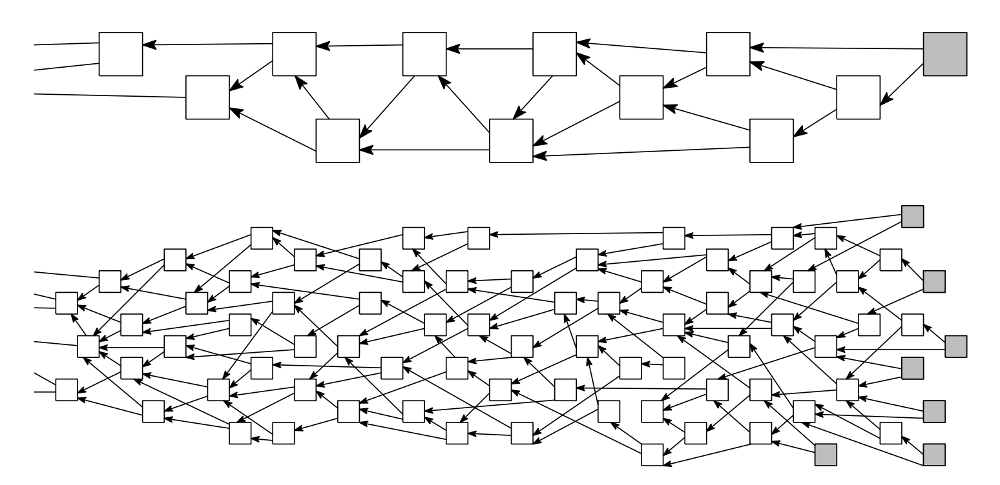

# Related Literature

## Federated Learning

The term lederated learning was coined in 2017 by McMahan et al. in their paper [_Communication-Efficient Learning of Deep Networks from Decentralized Data_](https://arxiv.org/abs/1602.05629). The paper highlights two problems when working with machine learning in distributed settings such as edge and fog computing scenarios: Data sensitivity \(hence, privacy concerns\) and data quantity \(transmission quantity limitations or costs\). Both problems prohibit transmission of data to centralized machine learning service and therefore prohibit continuous improvement of a model. 

In order to enable more use cases to continuously improve their models, they propose an approach that computes updates to a model locally and only transmits these updated models \(or model updates\) to a centralized component. They also prove robustness of this approach to unbalanced and non-IID data distributions as well as that the communication quantity is reduced by one to two magnitutes.

## Tangle

A tangle is a type of blockchain/distributed ledger that resembles a directed acyclic graph \(DAG\) rather than a linear chain of \(blocks of\) transactions. It was introduced in 2016 by Serguei Popov in [The Tangle](www.descryptions.com/Iota.pdf). Participating nodes propose updates by publishing transactions that validate and approve more than one preceding transaction. One key characteristic that is desired for a tangle is that it converges to one a common set of truths while being somewhat resistant to partial node outages and networks partitions.

The following picture shows a drawing of a Tangle data structure with approved transactions \(white squares\), approvals \(arrows\) and non-approved transactions \(so-called tips, grey squares\). A Tangle under high load \(lots of transactions taking place at the same time\) might take the lower wide form whereas a tangle under low load \(most transactions happending sequentially\) might be slimmer.  

## Decentralized Learning

There have been several attempts at combining federated learning and blockchain in order to facilitate a truly decentralized machine learning architecture. However, those approaches suffer from the possibility of malicious nodes introducing bad model updates into the network. Since there is no central component like in a conventional federated learning architectures, there is no intrinsic way to prohibit misbehaving nodes from doing so.

In _Tangle Ledger for Decentralized Learning_, published by Schmid et al. in 2020, the authors propose solving this problem by using a tangle distributed ledger and including semantic validity requirements in the basic consensus of the architecture: Each published model update is required to increase the performance of the model and approve two preceding updates' validity requirements. The validity of two approved preceding updates is checked by each node when publishing an update.

In the paper, they prove the viability of this approach by simulating a conceptual prototype and showing that benchmark results are almost as good as those of non-decentralized federated learning. 

