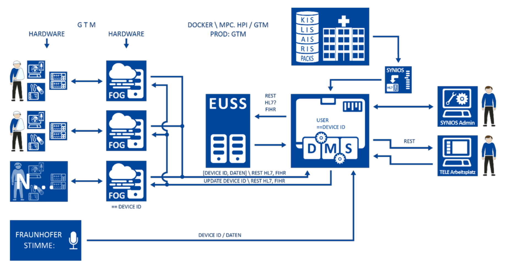

# Use Case: D-EUSS

Telemed5000 is a joint project by [Charite](https://www.telemed5000.de/partner/charite-universitaetsmedizin-berlin/)**,** [Getemed](https://www.telemed5000.de/partner/getemed-ag/), [Hasso Plattner Institute](https://www.telemed5000.de/partner/hasso-plattner-institut-hpi/), [Synios](https://www.telemed5000.de/partner/synios-gmbh/), [Fraunhofer IAIS](https://www.telemed5000.de/partner/fraunhofer-iais/), and [AIT](https://www.telemed5000.de/partner/ait-austrian-institute-of-technology-gmbh/). Their goal is to develop a system to remotely care for thousands of cardiological risk patients. The predecessor project [Fontane](https://telemedizin.charite.de/en/research/fontane/) proved that, on a smaller scale, such a system can prolong the live of cardiological risk patients while reducing the number of days spent in hospitals, thus improving their quality of life. 

In practice, this was achieved by monitoring patients' health data and evaluating it at the "EUSS" \(_Entscheidungsunterstützungssystem_, or decision support system\). By employing a machine learning model, the system predicts deterioration of a patient's health status and signals the need for intervention. 

From a computer science perspective, several challenges remain with the current architecture: 

One of these challenges is data privacy which might hinder large scale regulatory approval. Specially the transmission of sensitive patient health data to a central component is potentially problematic. Secondly, limited or slow internet connectivity might hinder the effectiveness of a system based on centralized data evaluation in large scale applications. It would be preferable to build the architecture such that it can run without connection to a central component. Last but not least, when applying the system to very large cohorts, it might be useful to provide a way of clustering and/or personalizing the predictions being made on a sub-global level.

From these ideas "**D**EUSS" \(_Dezentralisiertes Entscheidungsunterstützungssystem_, or decentralized decision support system\) was born. In a decentralized EUSS, each fog device performs machine learning itself. If an improved model was found, this model is propagated to the other fog devices and eventually accepted by all directly or indirectly connected devices. This way, a new consensus about the best model is built and improvements diffuse through the network. While distributing machine learning in a similar way has already been studied under the name of federated learning for some time, academic work on fully decentralized machine learning has only recently been started after the emergence of blockchains and similar distributed ledger architectures \(such as the Tangle\) that keep track of a global data consensus and organize how this consensus is reached. 

While this use case is certainly not the only one for the ideas examined in this project, it highlights the most important features that and implementation should strive for. 

