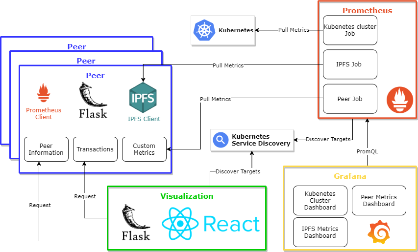

# Monitoring/Benchmarking

Monitoring a system is a process for collecting and storing state data. In the first phase of the project, there was no way to see how the system was behaving and performing. The first challenge we faced was how we could make sure that the tangle was being built in the right way \(i.e., it doesn't degenerate to a form where there are many separate chains and each node is effectively learning alone because it is not able to acquire improved models from the tangle\). Besides, we needed to evaluate the tip selection and transaction approval algorithm implementations. This motivated us to visualize the tangle in real-time. The next problem we confronted: Find out how well the learning tangle prototype performs when scaling up towards the [use case’s requirements](../../background/use-case.md). This called for an evaluation of related performance criteria like memory usage, CPU usage, and others. In order to solve this challenge, we had to create a comprehensive monitoring system for the learning tangle prototype.

The diagram below shows a high-level architecture of the distributed monitoring system. Prometheus, Grafana, and Visualization are the three main building blocks of the monitoring system. With the aid of the Kubernetes service discovery and other frameworks like Flask and React, the monitoring system was created.

In this section, we will guide you through how we approached these challenges and how we improved the monitoring and visualization of the system in the course of the project. 

