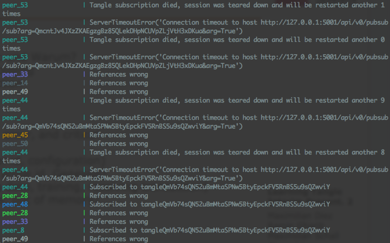

# Log-Based Monitoring

Early on in the project, the only information provided from the system was being printed on the console as standard output \(`stdout`\). In other words, these were system prints called by each peer to show the current state \(see figure below\).

The standard output was providing the following information about each peer:

* General peer information: Peer ID, configuration info
* Tangle information: Tangle ID, Genesis ID
* Status of a peer: Events about loading data, training, and publishing/receiving transactions
* Exceptions and error messages: Timeouts, out of memory exceptions, ...

To gain fast insight and get a feeling of how the system performing, we created a primary benchmark system. The benchmarking system read each line of the standard output of the peers and measured different metrics. These metrics included the following. 

* Number of peers: Counting the number of peer containers starting
* Number of subscribers: Counting the number of peers subscribing to the tangle
* Number of trainings: Counting the total number of training occurrences
* Number of failed trainings: Counting the total number of training failures
* Number of unpublished transactions: Increased if the training result was worse than the current consensus' performance
* Number of failed publishing transactions: Counting the publishing errors
* Number of published transactions: Total number of the transactions published
* Optimal number of received transactions: Number of published transactions multiplied by the number of total peers
* Number of received transactions: Total number of received transactions by all peers
* Number of peers exited with error code: Counting the containers leaving the system due to an error
* Last consensus averaged: Average model consensus
* Average time between trainings: Measuring the average time between previous training started

`stdout` was an inefficient way to show the information of each peer. As the number of peers grows, it was harder to follow the information printed on the console. Besides, after switching to orchestration systems like Kubernetes, it was not possible to read the `stdout` and measure the benchmarks any more because there is no native support for combining all service replica outputs. Moreover, if the system failed, there was no way to backtrack the find the cause of the failure. An abstraction layer for logging output in the peer helped to solve these problems. It provided multiple advantages like:

* See where and when \(even what line number\) a logging call is being made
* Easier differentiation of logging based on severity \(INFO, DEBUG, ERROR\)
* Multiplexing the log from standard output to any socket, file or similar 

The print function does not provide any of these features. After implementing the logging system, logs of experiments were written to a file. The benchmarking scripts read the file line by line and showed the result of the experiment.

This benchmarking system was providing enough insight to identify any possible improvements to the peer's code. One big drawback of this benchmarking system was that it could not evaluate the metrics in real-time. The system had to stop completely to run the benchmarking system. Besides, the system was reading the output and counting, comparing, and filtering the strings as metric values. So by changing the layout or syntax of the output, the benchmarking system would fail to calculate the metrics correctly. This motivated us to use more advanced monitoring tools like [Prometheus](https://prometheus.io/) and [Grafana](https://grafana.com/) for real-time monitoring and benchmarking.

