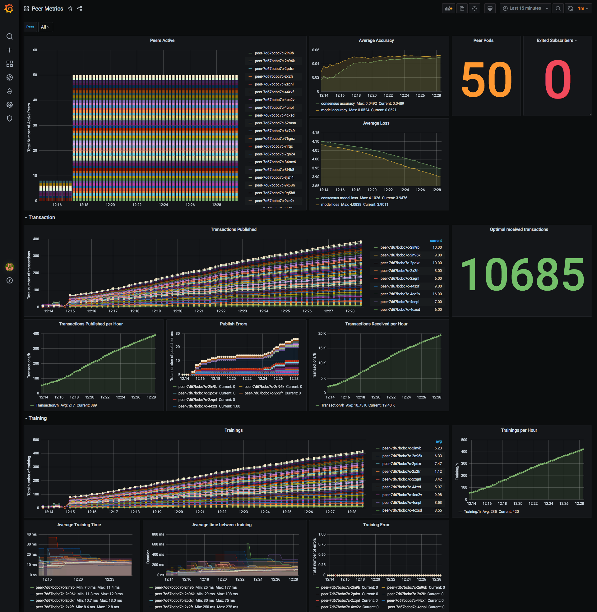
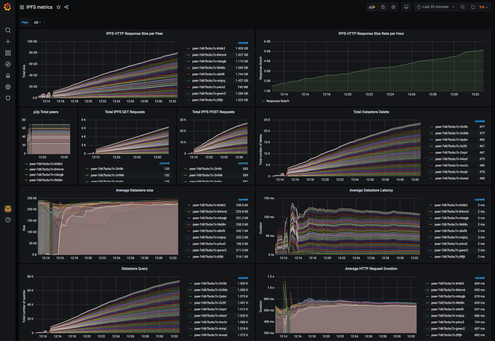
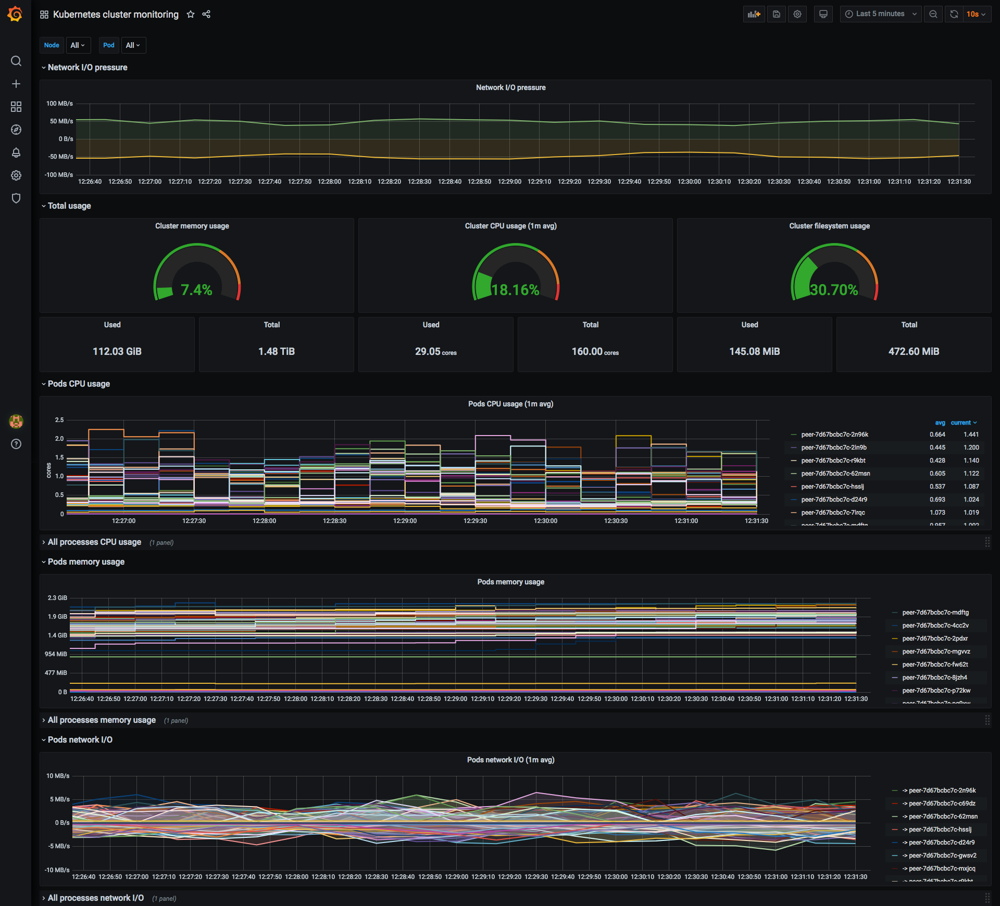

# Distributed Monitoring

## Prometheus

In the section [Tech Stack](../../architecture.md), we described Prometheus as a time series database that scrapes metrics in a pull manner from other services' endpoints. Prometheus uses the Kubernetes service discovery under the hood, to discover the peers during run-time and scrape their metrics. The official[ Prometheus client](https://github.com/prometheus/client_python) for Python was used in the peer to define custom metrics in a standard manner so that Prometheus could scrape them.

As demonstrated below, Prometheus has three main jobs:

* Kubernetes cluster job: Scrapes the built-in Kubernetes metrics. These metrics are used to monitor the node health like CPU usage, memory usage, etc. These metrics also provide information about each pod and container using the information provided by [cAdvisor](https://github.com/google/cadvisor).
* IPFS job: This job scrapes the IPFS metrics provided by the IPFS client in each peer. Prometheus uses the service discovery to connect to the peers and the IPFS metric endpoint inside each peer to scrape the data.
* Peer job: This job is responsible for scraping the [custom metrics](https://app.gitbook.com/@hpimpss2020/s/documentation/~/drafts/-MHpCT7jk2GneLLOpomO/scaling/distributed-monitoring-and-benchmark-system/benchmarking-and-logging-system) \(e.g. total number of trainings, model accuracy\) provided by each peer.

A detailed description of each metric and the targets can be found in the Prometheus dashboard under `http://<Prometheus-LoadBalancerIP>:9090.`

## Grafana

As explained [before](https://app.gitbook.com/@hpimpss2020/s/documentation/~/drafts/-MG8H02gkOhru0hVlfib/tech-stack/monitoring/@drafts#grafana), Grafana is one of the most well-known tools for creating monitoring dashboards. We used the built-in support for Prometheus to query the data using PromQL and create different dashboards with various diagrams. In the subsections below the three main dashboards are shown. A description is provided in the Grafana dashboard for each diagram. The dashboards and diagrams are accessible at `http://<Grafana-LoadBlancerIP>:3000`. Username and password is `admin` by default.

### Dashboards

A dashboard is a set of one or more panels organized and arranged into one or more rows. In order to have a clear overview of the different panels, the diagrams are ordered in three main dashboards:

#### Peer metrics dashboard

Custom metrics of each peer

#### IPFS metrics dashboard

Metrics provided by the IPFS daemon

#### Kubernetes cluster monitoring dashboard

Metrics provided by Kubernetes about the status of the node and the pods/containers

