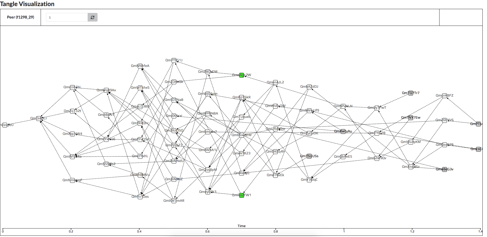

# Visualization

The visualization shows the state of the tangle in a web browser. The project is a fork from the [IOTA visualization](https://gitlab.hpi.de/osm/tangle-learning/iotavisualization) repository. As mentioned before, there was no way to see if the tangle was being built in the right way. Another motivation was the evaluation of the tip selection and transaction approval algorithms. 

To integrate the visualization project, some adjustment to the code was necessary. First, we containerized the code so we could deploy it in the cluster. The visualization needs to use the service discovery of Kubernetes to find out how many active peers exist and how to reach them. To do so, we added multiple endpoints using the [Flask](https://flask.palletsprojects.com/en/1.1.x/) micro-framework in the peer and the visualization as well. Flask exposes in the peer side transaction information \(e.g. transaction creation time, transaction ID\). Whereas in the visualization side Flask is used for service discovery, i.e. to get the peer IP addresses in the Kubernetes cluster.

The tangle visualization looks like the figure below. In the upper left part, the user can switch between peers. The green transactions demonstrate the transactions that the currently selected peer \(i.e. the peer f1298\_29 in the figure below\). The grey squares show the tips of the tangle.



Below you can see each endpoint used in the visualization and its description.



Fetch peer IP addresses



Uses the Kubernetes service discovery to get a list of all available peer IPs








If there are 5 peers in the cluster, the API will yield the following output:


```
["10.42.0.34", "10.42.0.53", "10.42.0.91", "10.42.0.106", "10.42.0.103"]
```







Fetch transactions



Fetches the transactions generated and received from a peer






The internal pod IP of a peer in the Kubernetes cluster







The returned object includes a genesis transaction ID \(and therefore the Tangle identifier\) and an array of nodes \(also including the genesis\). Each node element consists of a transaction ID, an array of parents transaction IDs, a peer object showing the peer ID, a relative time to logically order the transactions, and a 'timeCreated' field indicating the creation timestamp of the transaction.


```
{
   "genesis":"QmUzqyeUXTvEyoj8FDpUSNWgWghLpoFyPnVUkcDh9wg1u5",
   "nodes":[
      {
         "name":"QmUzqyeUXTvEyoj8FDpUSNWgWghLpoFyPnVUkcDh9wg1u5",
         "parents":[
            
         ],
         "peer":{
            "client_id":"fffff_ff"
         },
         "time":0,
         "timeCreated":"2020-10-01 11:11:12.225962"
      },
      {
         "name":"QmXe2Bg9f1198g22TVemBur6oyzHNmpJzd2a8j36wZdZP5",
         "parents":[
            "QmUzqyeUXTvEyoj8FDpUSNWgWghLpoFyPnVUkcDh9wg1u5"
         ],
         "peer":{
            "client_id":"f2024_20"
         },
         "time":0.1,
         "timeCreated":"2020-10-01 11:11:38.522278"
      },
      {
         "name":"QmcK4kUavfGzhkjGKJkDDUTWQez7pgWgfLb5SEgnkVQ2En",
         "parents":[
            "QmXe2Bg9f1198g22TVemBur6oyzHNmpJzd2a8j36wZdZP5"
         ],
         "peer":{
            "client_id":"f0316_21"
         },
         "time":0.2,
         "timeCreated":"2020-10-01 11:13:19.648610"
      },
      {
         "name":"QmTfcpaqDSQ4bmPCutJeDytyveFK114ZK4bmxU9HmwzgBX",
         "parents":[
            "QmcK4kUavfGzhkjGKJkDDUTWQez7pgWgfLb5SEgnkVQ2En"
         ],
         "peer":{
            "client_id":"f0316_21"
         },
         "time":0.30000000000000004,
         "timeCreated":"2020-10-01 11:14:33.503987"
      },
      {
         "name":"QmXxzQYbPJa4U6P3NLSiq23ZL3Z7Kwcr47KR5AjWQXGvNZ",
         "parents":[
            "QmTfcpaqDSQ4bmPCutJeDytyveFK114ZK4bmxU9HmwzgBX"
         ],
         "peer":{
            "client_id":"f1381_00"
         },
         "time":0.4,
         "timeCreated":"2020-10-01 11:14:59.496605"
      },
      {
         "name":"QmcFCy8uA9ashRFtKMCxit3zx1FRM3GnM1TiFJmSBX9bGX",
         "parents":[
            "QmXxzQYbPJa4U6P3NLSiq23ZL3Z7Kwcr47KR5AjWQXGvNZ"
         ],
         "peer":{
            "client_id":"f2024_20"
         },
         "time":0.5,
         "timeCreated":"2020-10-01 11:15:48.581395"
      }
   ]
}
```







Fetch peer information



Fetches information of each peer






The internal pod IP of a peer in the Kubernetes cluster







The response includes the unique client ID of each peer.


```
{client_id: "ff12345"}
```





