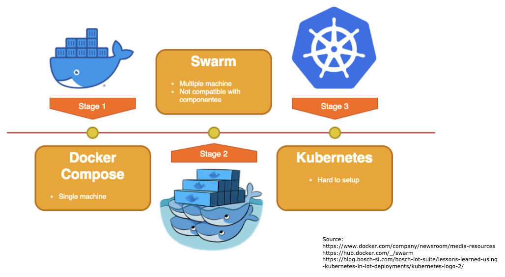

# Containerization & Orchestration

The project aims to create a distributed machine learning platform. To be able to distribute and scale the project on either one single or multiple hosts, technologies like [Docker](https://www.docker.com/), [Docker Swarm](https://docs.docker.com/engine/swarm/), and [Kubernetes](https://kubernetes.io/) were tested and used. The diagram below demonstrates the containerization and orchestration journey during project development. This chapter describes each technology used and why some of them were deprecated.

## Docker

[Docker ](https://www.docker.com)is a tool that provides an easy way to create, deploy, and run applications in a loosely coupled and isolated environment called containers. "The isolation and security allow you to run many containers simultaneously on a given host". Containers can run on various Linux distributions \([CentOS](https://hub.docker.com/editions/community/docker-ce-server-centos), [Debian](https://hub.docker.com/editions/community/docker-ce-server-debian), [Fedora](https://hub.docker.com/editions/community/docker-ce-server-fedora), [Oracle Linux](https://hub.docker.com/editions/enterprise/docker-ee-server-oraclelinux), [RHEL](https://hub.docker.com/editions/enterprise/docker-ee-server-rhel), [SUSE](https://hub.docker.com/editions/enterprise/docker-ee-server-sles), and [Ubuntu](https://hub.docker.com/editions/community/docker-ce-server-ubuntu)\) and [Windows Server](https://hub.docker.com/editions/enterprise/docker-ee-server-windows), making it completely decoupled from the infrastructure and the environment deployed.

"[Compose ](https://docs.docker.com/compose/)is a tool for defining and running multi-container Docker applications. With Compose, you use a YAML file to configure your application’s services. Then, with a single command, you create and start all the services from your configuration".

Docker made it possible to containerize each sub-system \(e.g. Peer, Bootstrap, Visualization\) and deploy the same container multiple times with the same configuration. With the help of Compose building and pushing the modules/containers to the container registry can be done in a matter of running a single command, even with different architectures \(e.g., arm32 and arm64\). The commands can be found in the [Getting Started](https://app.gitbook.com/@hpimpss2020/s/documentation/~/drafts/-MHplcW0F9U5Z8hpQqvE/getting-started#building-and-pushing-images) chapter. Therefore, Docker-Compose paved the way for deploying all the modules and scaling the peers on a single machine.

## Swarm

Docker swarm is a tool that manages a cluster of Docker hosts and orchestrates containers on multiple host machines. Each host of the Docker Swarm consists of a docker daemon, these daemons interact with each other using the Docker API. In **swarm mode**, Docker hosts can act as managers \(to manage membership and delegation\) and workers, which run [swarm services](https://docs.docker.com/engine/swarm/key-concepts/#services-and-tasks) or even both. 

Docker swarm made the deployment of containers on multiple machines more usable. Besides, the daemon was not getting overwhelmed because both managers and workers consist of their docker daemon. The main problem of Docker Swarm is that there is no support for multicasting on the network between containers. However, IPFS requires multicast for proper functioning. Moreover, at this time, the service discovery of Docker swarm on Prometheus is in the early stages of development. Therefore, the configuration and setup of the monitoring come at a high effort. To handle these problems, we switched to the more advanced orchestration platform Kubernetes.

## Kubernetes

"[Kubernetes ](https://kubernetes.io/docs/concepts/overview/what-is-kubernetes/)is a portable, extensible, open-source platform for managing containerized workloads and services, that facilitates both declarative configuration and automation".

Kubernetes is offering out of the box multicasting, node metrics, and service discovery. These built-in functionalities accelerated the setup time and eased the Prometheus and Grafana configuration. With the help of YAML files [deployment](https://kubernetes.io/docs/concepts/workloads/controllers/deployment/)s, [service](https://kubernetes.io/docs/concepts/services-networking/service/)s, and [configuration](https://kubernetes.io/docs/concepts/configuration/configmap/)s can be pushed to the Kubernetes cluster. The transition from a Docker-Compose YAML file to different Kubernetes files is not trivial. Tools like [Kompose ](https://kompose.io/)were used to speed up this process. Kompose is a conversion tool for Docker Compose to container orchestrators such as Kubernetes. The Kubernetes cluster on our high-performance simulation hardware was equipped with [K3S](https://k3s.io/), a highly available, certified Kubernetes distribution, which under the hood uses [Containerd ](https://containerd.io/)to manage its containers in each pod. 

Although Kubernetes made it easy to orchestrate and scale the pods on multiple clusters, there was some unexpected behaviour at scale. One unanticipated finding was that the disk usage of the peers is high and there is no solution to clean the disk or even increase the disk volume of Containerd. Even by restarting the pod, Kubernetes is not able to clean the files produced from the deleted pod. A workaround for this problem was that we decreased the training interval, so we filled less space on the disk and used the [IPFS garbage collection](https://www.ctrl.blog/entry/ipfs-repo-cache-gc.html#:~:text=A%20common%20myth%20perpetuated%20by,to%20run%20on%20a%20schedule.) to clear cached weights for more free space.

